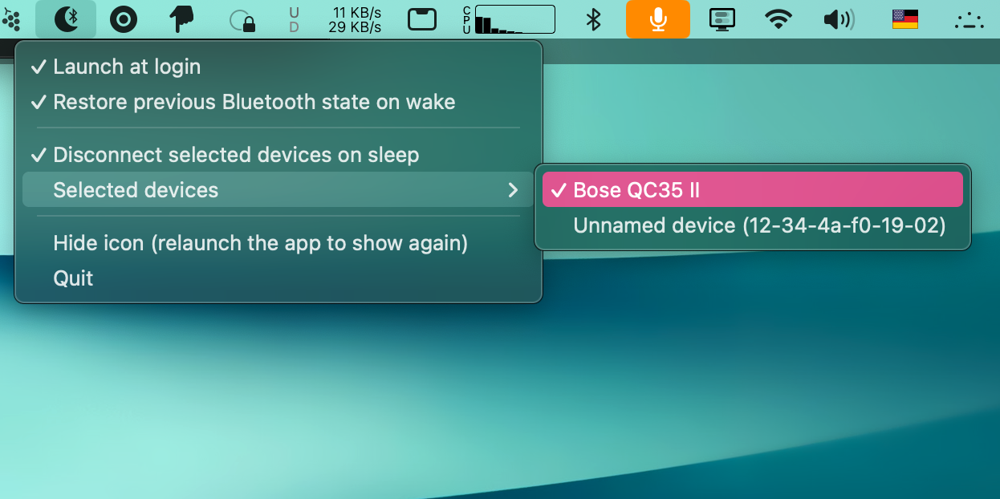

# Bluesnooze



> [!IMPORTANT]
> This is a personal fork of
> [odlp/bluesnooze](https://github.com/odlp/bluesnooze) that I keep
> around for my own use. I forked it because the upstream has not had
> a commit since July 2023 and I needed a few changes (notably the
> per-device disconnect mode) to keep it useful on a current macOS.
> I am not a Swift developer, I do not plan to maintain this for
> anyone else, and I am not accepting pull requests, feature requests,
> or bug reports. If you want a supported version, use
> [the upstream](https://github.com/odlp/bluesnooze) or fork this
> yourself.

A small macOS menu bar app that disconnects Bluetooth on sleep so your
sleeping Mac stops grabbing devices like headphones away from your
phone.

Requires macOS 13 (Ventura) or later.

## What it does

When your Mac sleeps, Bluesnooze can either:

1. Turn the Bluetooth controller off entirely, or
2. Disconnect a chosen set of paired devices (e.g. headphones) while
   leaving the controller on, so a Bluetooth keyboard or mouse can
   still wake the Mac.

When your Mac wakes, Bluesnooze restores Bluetooth (or reconnects the
chosen devices). By default it remembers the pre-sleep state, so if
you had Bluetooth off before sleeping, it stays off.

## Settings

All settings live in the menu bar icon:

- **Launch at login**
- **Restore previous Bluetooth state on wake** (on by default). When
  off, Bluetooth is always turned on at wake.
- **Disconnect selected devices on sleep**. When on, Bluesnooze
  disconnects the devices you pick from the **Selected devices**
  submenu instead of powering the controller down.
- **Selected devices**. The list of paired Bluetooth Classic devices.
  Tick the ones to disconnect on sleep.
- **Hide icon**. Hides the menu bar icon. To bring it back, launch
  Bluesnooze again from Finder or Spotlight.

## Installation

There is no signed release for this fork. Build it from source:

```sh
git clone https://github.com/mre/bluesnooze.git
cd bluesnooze
xcodebuild -project Bluesnooze.xcodeproj -scheme Bluesnooze \
    -configuration Release build
```

The built `.app` will be in
`~/Library/Developer/Xcode/DerivedData/Bluesnooze-*/Build/Products/Release/`.
Drag it into `/Applications`.

The original signed release is available at
[odlp/bluesnooze](https://github.com/odlp/bluesnooze) or via
`brew install bluesnooze`.

## Changes in this fork

- Added a per-device disconnect mode, adapted from
  [stefansundin/bluesnooze#6](https://github.com/stefansundin/bluesnooze/pull/6).
- Added a "restore previous Bluetooth state on wake" toggle (on by
  default).
- Added a "hide icon" menu item that can be undone by relaunching the
  app, without using the terminal.
- Migrated from Carthage to Swift Package Manager.
- Removed the last bits of Objective-C/C. The project no longer has a
  bridging header; the two private `IOBluetooth` C symbols are
  declared directly in Swift. The codebase is now pure Swift. This
  does not change the build itself, but means contributors only need
  to read one language.
- Replaced
  [LaunchAtLogin-Legacy](https://github.com/sindresorhus/LaunchAtLogin-Legacy)
  with
  [LaunchAtLogin-Modern](https://github.com/sindresorhus/LaunchAtLogin-Modern).
  The legacy package was archived in September 2025.
- Adopted `os_log` for diagnostics. View logs with:
  ```sh
  log stream --predicate 'process == "Bluesnooze"'
  log show --process Bluesnooze --info --last 1h
  ```
- Bumped the minimum macOS version to 13.

## Migrating from upstream

Settings live under the same `com.oliverpeate.Bluesnooze` defaults
domain and are picked up unchanged. You will need to re-enable
"Launch at login" once, because this fork uses `SMAppService` and the
old registration does not carry over.

## Caveats

- Not compatible with the "Allow your Apple Watch to unlock your Mac"
  feature.
- Cannot be distributed via the App Store because it uses a private
  Bluetooth API to toggle the controller.
- The per-device disconnect list shows Bluetooth Classic devices only.
  BLE devices are excluded because `IOBluetoothDevice.closeConnection`
  is unreliable for them.
- Apple peripherals using a randomised Bluetooth address (e.g. Magic
  Keyboard) appear as `Unnamed device (12-34-...)`. The legacy
  `IOBluetooth` API does not return a friendly name for them.

## Configuration via `defaults`

```sh
# Read all settings
defaults read com.oliverpeate.Bluesnooze

# Always force Bluetooth on at wake (the original behaviour)
defaults write com.oliverpeate.Bluesnooze restorePreviousStateOnWake -bool false

# Per-device disconnect mode
defaults write com.oliverpeate.Bluesnooze disconnectDevicesOnSleep -bool true
defaults write com.oliverpeate.Bluesnooze devicesToDisconnectOnSleep \
    -array "12-34-4a-f0-19-02" "00-1d-43-aa-bb-cc"

# Hide / show the menu bar icon
defaults write com.oliverpeate.Bluesnooze hideIcon -bool true && killall Bluesnooze
defaults delete com.oliverpeate.Bluesnooze hideIcon && killall Bluesnooze
```

## Credits

Original app by [Oliver Peate](https://github.com/odlp). Per-device
disconnect feature originally proposed by
[ramatah](https://github.com/ramatah) in
[stefansundin/bluesnooze#6](https://github.com/stefansundin/bluesnooze/pull/6).